# API Dependency Diagrams - NoobGG

## 1. Component-to-API Relationship Diagram

```mermaid
graph LR
    subgraph "Frontend Components"
        GD[Games Dashboard]
        GRD[Game Ranks Dashboard]
        PD[Platforms Dashboard]
        LD[Languages Dashboard]
        UP[User Profile]
    end
    
    subgraph "API Hooks Layer"
        UG[useGames]
        UGR[useGameRanks]
        UPL[usePlatforms]
        UL[useLanguages]
        UUP[useUserProfile]
    end
    
    subgraph "API Actions Layer"
        GA[Games Actions]
        GRA[GameRanks Actions]
        PA[Platforms Actions]
        LA[Languages Actions]
        UPA[UserProfile Actions]
    end
    
    subgraph "Backend API Endpoints"
        GE[/api/v1/games]
        GRE[/api/v1/game-ranks]
        PE[/api/v1/platforms]
        LE[/api/v1/languages]
        UPE[/api/v1/user-profiles]
    end
    
    GD --> UG
    GRD --> UGR
    PD --> UPL
    LD --> UL
    UP --> UUP
    
    UG --> GA
    UGR --> GRA
    UPL --> PA
    UL --> LA
    UUP --> UPA
    
    GA --> GE
    GRA --> GRE
    PA --> PE
    LA --> LE
    UPA --> UPE
```

## 2. API Call Flow Sequence Diagram

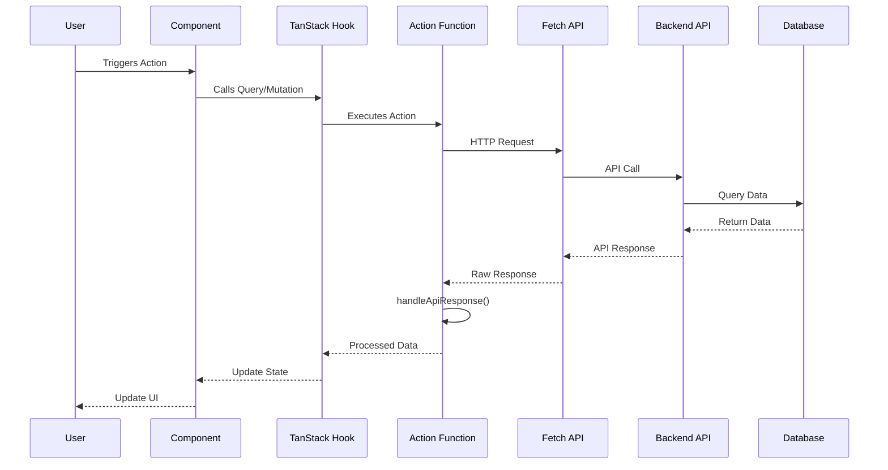

## 3. Authentication Flow Diagram

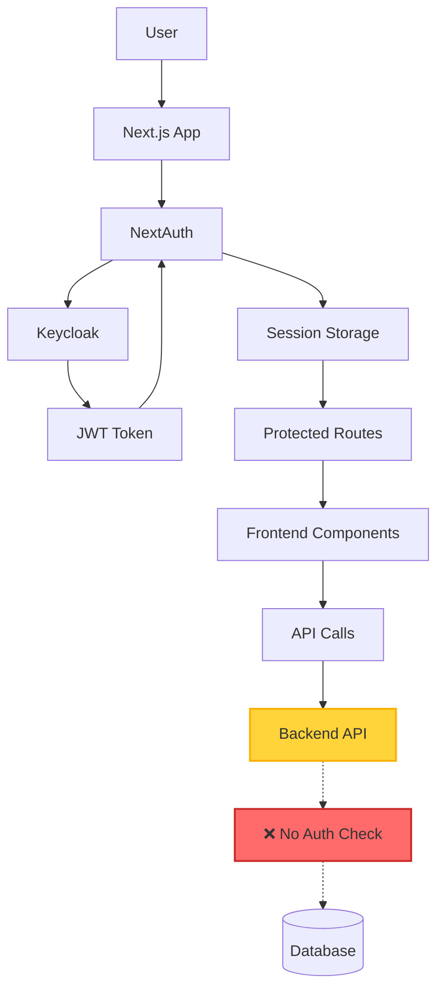

## 4. Data Flow Architecture

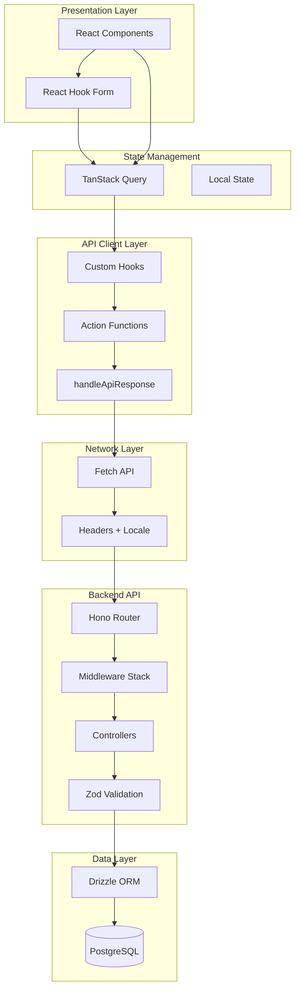

## 5. API Endpoint Dependency Matrix

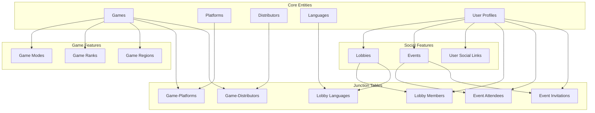

## 6. Frontend Feature to API Mapping

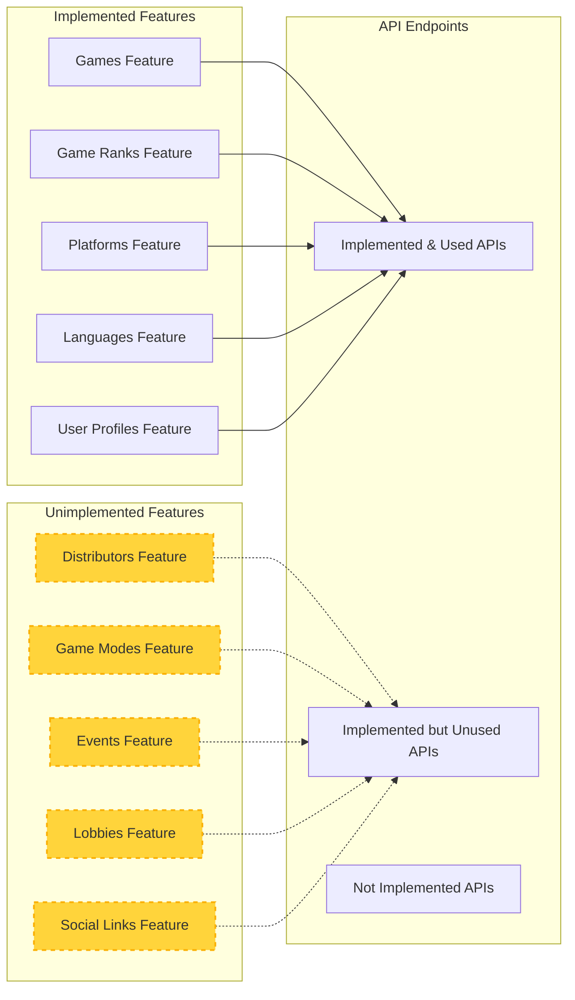

## 7. Error Handling Flow

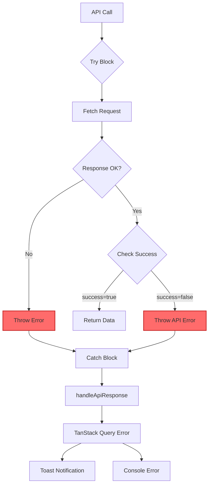

## 8. Shared Package Dependencies

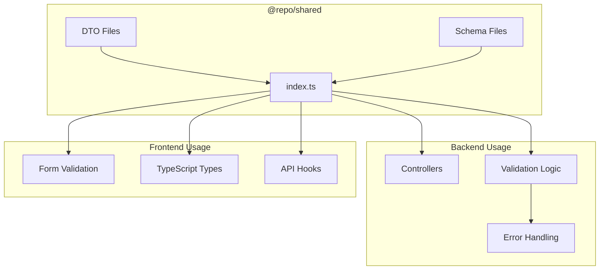

## 9. Security Vulnerability Map

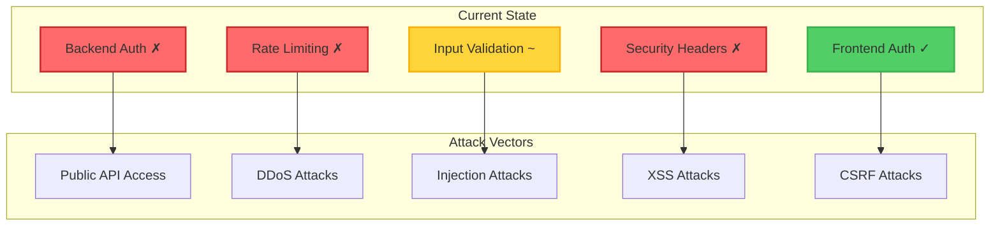

## 10. Caching Strategy Diagram

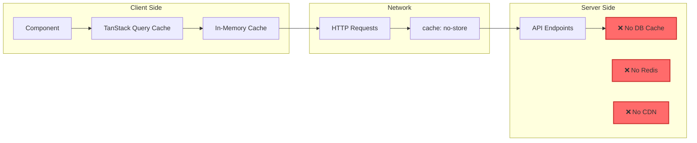

## 11. Environment Configuration Flow

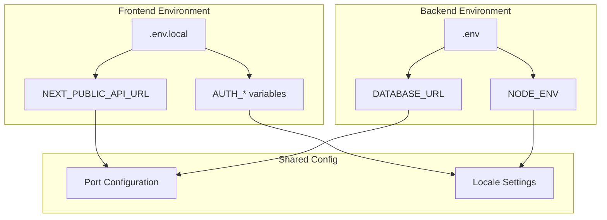

## 12. API Lifecycle Diagram

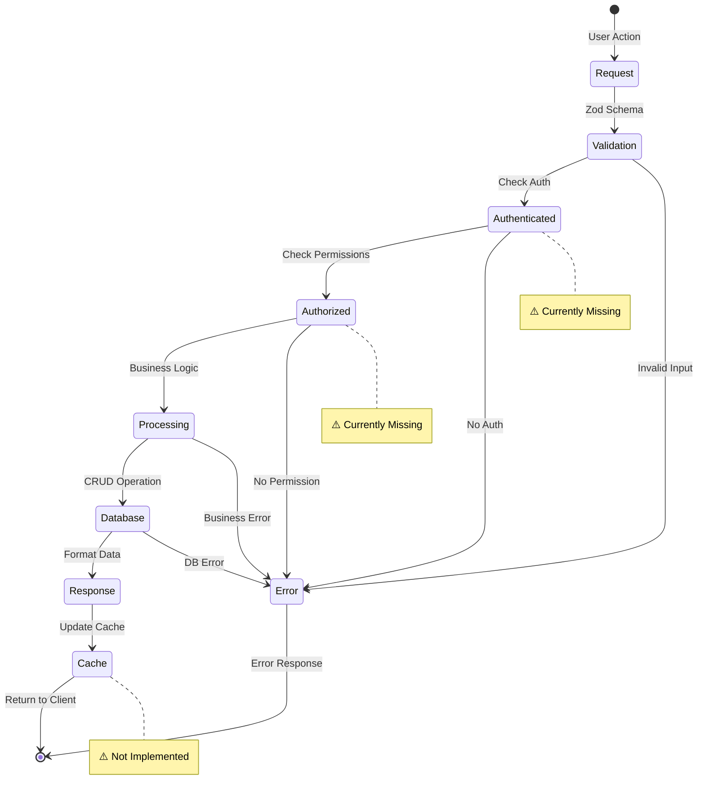

These diagrams provide a comprehensive visual representation of the API architecture, dependencies, and data flows in the NoobGG project, highlighting both the implemented features and the critical gaps that need to be addressed.